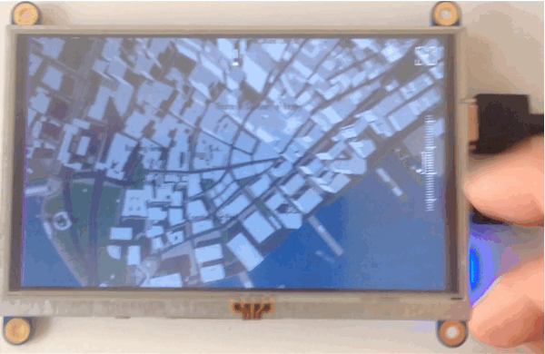
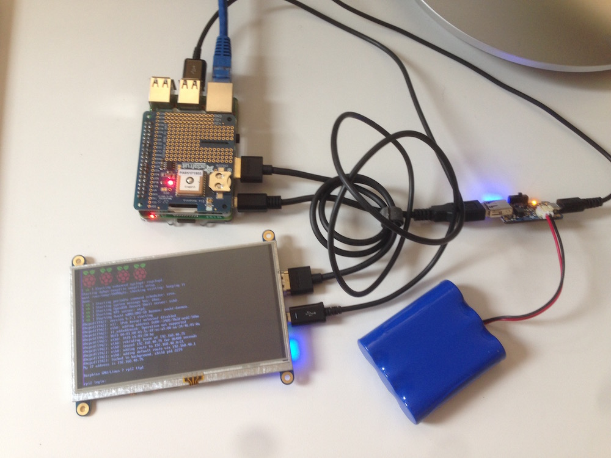
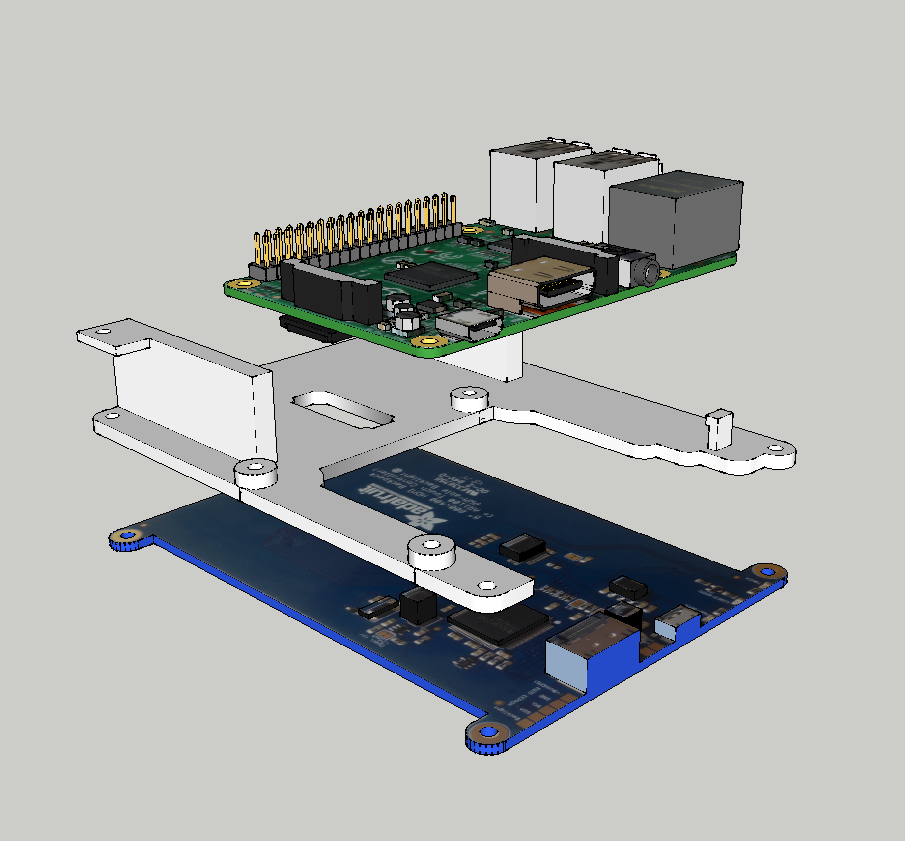
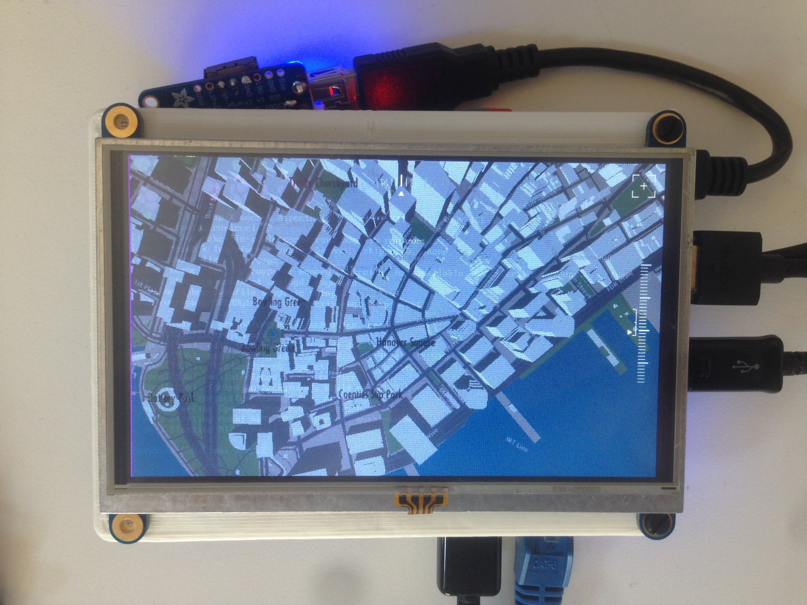
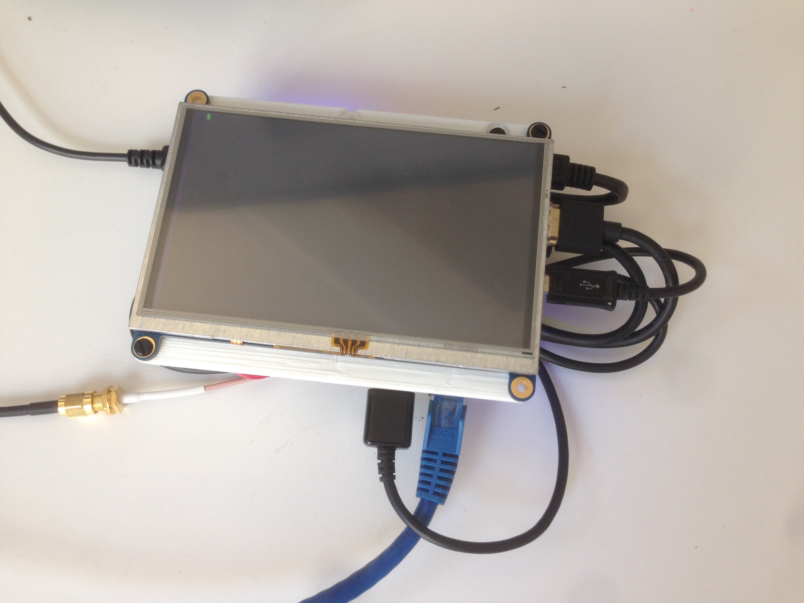

# Make your own GPS device with Tangram-es and RaspberryPi

A couple of months ago the nice folks at RaspberryPi published a [blog post](https://www.raspberrypi.org/tangram-an-open-source-map-rendering-library/) about [Tangram-ES](https://github.com/tangrams/tangram-es), Mapzen's native 2D/3D map rendering engine running on their hardware. The feedback was great and people seemed to be very excited to start using it for their own projects.

Tangram-ES is a work-in-progress map engine written in C++ and openGL ES 2.0, so it can be a little intimidating to start from scratch. That's why we thought this small weekend project could get the ball rolling and ignite some ideas in the community.

In [this github repository](https://github.com/tangrams/PI-GPS) you will find:

- A 3D-printable model to mount together a RaspberryPi A+/B+, [Adafruit’s touch HDMI 5’’ 800x480 ](https://www.adafruit.com/product/2260), [Ultimate GPS Raspberry PI HAT](https://www.adafruit.com/products/2324), [Lithium Ion Battery](https://www.adafruit.com/products/353) and [PowerBoost 1000 Charger](https://www.adafruit.com/products/2465).

- Source code to run Tangram-es with a nice little graphical interface to move, rotate and zoom a map with a touch-only screen.

- An explanation on how you can modify ```tangram.cpp``` of Tangram-ES to load tiles locally.

## Hardware

Besides your RaspberryPi I’m using the following components to make a stand alone device:

- [HDMI 5’’800x480 Touch Screen](https://www.adafruit.com/product/2260)

- [Ultimate GPS Raspberry PI HAT](https://www.adafruit.com/products/2324)

- [Lithium Ion Batter](https://www.adafruit.com/products/353) 

- [PowerBoost 1000 Charger](https://www.adafruit.com/products/2465)



These are held together with the 3D-printed mounting station defined in the file: ```parts/rpi-screen-mount.stl```.



Once you put everything together, it should look something like this:




## Compile and install Tangram-ES with a nice UI for RaspberryPi

Now let’s jump into the code of this project.

First we need to clone this repository in your raspberryPi and install some dependences to compile everything.

```bash
sudo apt-get update
sudo apt-get install cmake libcurl4-openssl-dev g++-4.8
cd ~
git clone https://github.com/tangrams/PI-GPS.git
cd PI-GPS
git submodule update --init --recursive
mkdir build
```

Then, just to make sure it is working, compile tangram and then run it.

```bash
export CXX=/usr/bin/g++-4.8
cd build
cmake ..
make
cd bin
./pi-gps -m
```

*Note:* we are running tangram with the ```-m``` flag to display the mouse.

## Modify Tangram-ES to fetch tiles locally

Getting fast internet access to your RaspberryPi could be a problem, especially if you are planning to use this GPS device on your bicycle. Let’s see what you need to do to download the map tiles locally making your map network-independent.

We installed Tangram-ES and tested it in the previous section. Now is time for us to make some changes so Tangram-ES will search for local files instead of fetching them from a server.

With these changes, tangram will search for tiles inside the ```tiles/``` directory.

Open ```~/PI-GPS/tangram-es/core/src/tangram.cpp``` in you favorite text editor:

```bash
cd ~/PI-GPS/tangram-es
vim core/src/tangram.cpp
```

Then add at top of the file these includes…

```cpp
#include <string>
#include <unistd.h>
```

…and at the ```void initialize()``` function where the ```TileManager``` is set, replace the text to make it look like this:

```cpp
// Create a tileManager
…

if (!m_tileManager) {
    m_tileManager = TileManager::GetInstance();

    // Pass references to the view and scene into the tile manager
    m_tileManager->setView(m_view);
    m_tileManager->setScene(m_scene);

    // Fetch Json local files
    char result[ FILENAME_MAX ];
    getcwd(result, FILENAME_MAX);
    std::unique_ptr<DataSource> dataSource(new GeoJsonSource());
    dataSource->setUrlTemplate("file://"+std::string(result)+"/tiles/[z]-[x]-[y].json");

    m_tileManager->addDataSource(std::move(dataSource));
}

…
```

Save, exit and recompile to apply these changes.

```bash
cd ~/PI-GPS/
export CXX=/usr/bin/g++-4.8
make
```

## Get the tiles of a town/city/region from OpenStreetMap 

My colleague and friend [Peter Richardson](https://twitter.com/meetar) made this useful set of python scripts for downloading tiles locally at the repo called  [Landgrab](https://github.com/tangrams/landgrab). 

Let’s start by downloading some dependencies for this script.

```
sudo apt-get update
sudo apt-get install wget python-pip
sudo pip install requests
```

Then download Peter’s script in the directory where tangram was compiled:

```bash
cd ~/PI-GPS/build/bin
wget https://raw.githubusercontent.com/tangrams/landgrab/master/landgrab.py
```

Now is the time to download some vector tiles. For that we need the [OpenStreetMap](http://www.openstreetmap.org/) ID of the place we want to download. Go to [OpenStreetMap Website](http://www.openstreetmap.org/) and search for a location and check its ID (the number between brackets).

For example:

* Buenos Aires (1224652)
* London (65606)
* Manhattan (3954665)
* New YorkCity (175905)
* Paris (7444)
* Rio de Janeiro (2697338)
* Rome (41485)
* Sydney (13766899)
* Tokyo (4479121)
* Tucson (253824)

**Note**: If you choose a city other than Manhattan you have to change the coordinates in ```tangram.cpp``` so tangram knows where to center the map (around line 44):

```cpp
// Move the view to coordinates in Manhattan so we have something interesting to test
glm::dvec2 target = m_view->getMapProjection().LonLatToMeters(glm::dvec2(-74.00796, 40.70361));
```

Once we choose a place, tangram will start fetching the vector tiles that we will need. For that we will use the python script we downloaded with the given OSM ID and the zoom level we are interested (in our case all of them are from 1 to 18).

```bash
python landgrab.py 3954665 1-18
```

This may take a while. Go get a coffee. 

## Finally! Run it and enjoy your 3D map!

Well done! Everything is ready, unplug your internet connection and run tangram on your RaspberryPi! 

```bash
cd ~/PI-GPS/build/bin
./pi-gps -m
```

I hope you are excited about all the possibilities of having cool 3D maps on your projects. [Send us](http://twitter.com/mapzen) your opinions, feedback or photos of your work!